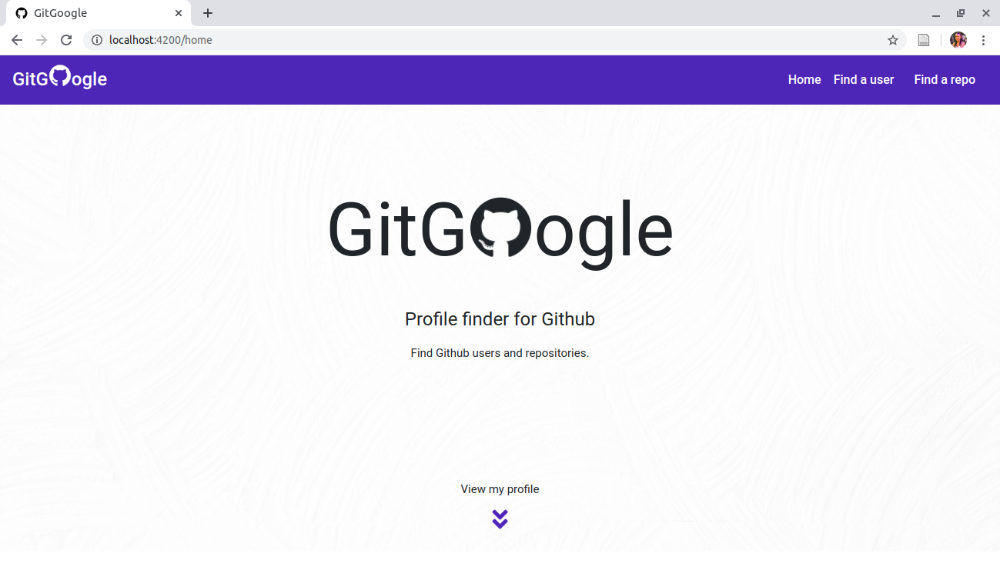

# GitGoogle
#### A Github finder that allows users to search for Github users by username and Github repositories by reponame , 17/05/2020.
#### By Lorna Kamau

## Description
On the application's landing page, we have a navigation bar and a brief definition of what the application is about. By clicking on the arrows at the bottom of the landing page, one is able to view the developer's github profile. Clicking on the 'Find a user' button displays an input field where one enters the username they wish to search. Similarly for the 'Find a repo' button. The search results then display relevant information on the Github user and Github repository respectively.

## Live link
Visit the application on https://lornakamau.github.io/git-google/ .

## Development

#### Development server

Run `ng serve` for a dev server. Navigate to `http://localhost:4200/`. The app will automatically reload if you change any of the source files.

#### Code scaffolding

Run `ng generate component component-name` to generate a new component. You can also use `ng generate directive|pipe|service|class|guard|interface|enum|module`.

#### Build

Run `ng build` to build the project. The build artifacts will be stored in the `dist/` directory. Use the `--prod` flag for a production build.

#### Running unit tests

Run `ng test` to execute the unit tests via [Karma](https://karma-runner.github.io).

#### Running end-to-end tests

Run `ng e2e` to execute the end-to-end tests via [Protractor](http://www.protractortest.org/).

#### Making modifications

To make advancements/modifications, follow these steps:

- Fork the repository
- Create a new branch (`git checkout -b improve-feature`)
- Make the appropriate changes in the files
- Add changes made
- Commit your changes (`git commit -am 'Improve feature'`)
- Push to the branch (`git push origin improve-feature`)
- Create a Pull Request 

## Technologies Used

This project was generated with [Angular CLI](https://github.com/angular/angular-cli) version 9.1.4.
The technologies used are HTML, CSS, Typescript and Bootstrap.

## Support and contact details

Should you be unable to access the website, have any recommendations and/or questions, feel free to email me:[kamaulorna@gmail.com](mailto:kamaulorna@gmail.com)

## To-do
1. Include pagination for API responses
2. Include code that changes color of language indicator based on language used to write a specific repository

## [License](https://github.com/lornakamau/git-google/blob/master/LICENSE.md)

Copyright (c) 2020 [Lorna Kamau](https://github.com/lornakamau)  

